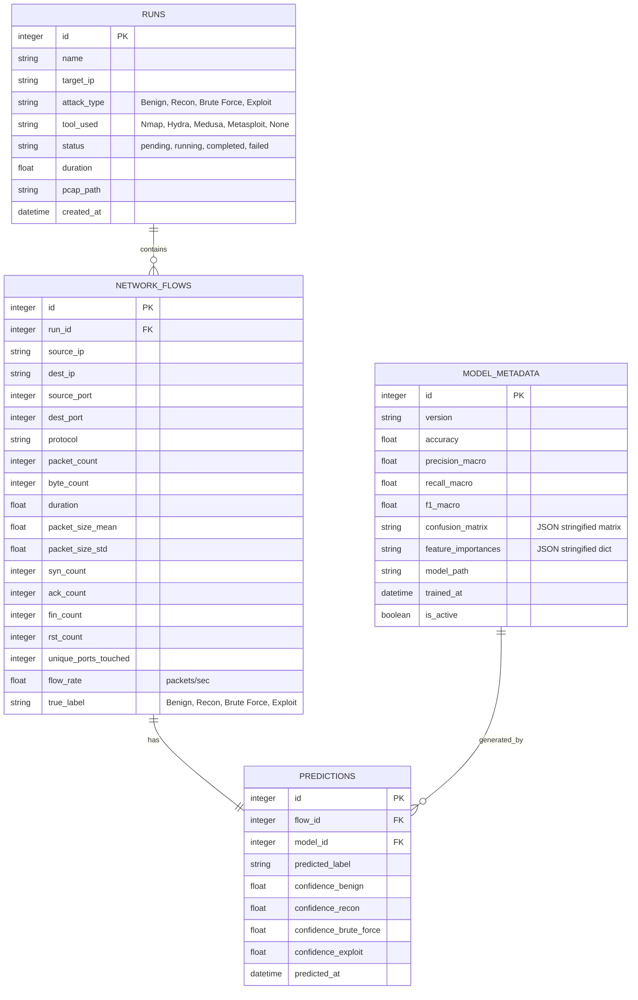
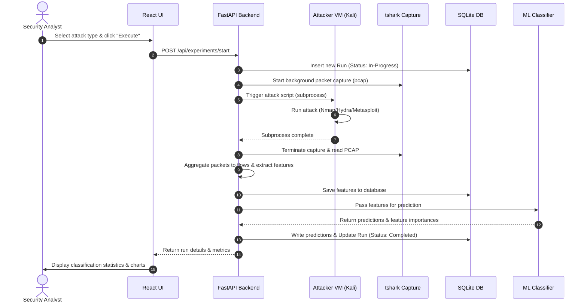

# Product Requirement Document (PRD)

## Project Name: NetTrace
**Subtitle**: Machine Learning-Based Classification and Forensic Analysis of Network Traffic Generated by Controlled Penetration Testing

---

## 1. Project Synopsis & Objectives
Most security tools flag suspicious events without providing deep visibility into how specific attacks look in raw network traffic, or identifying the exact flow patterns that trigger detection. NetTrace addresses this gap by generating customized, reproducible traffic traces under controlled conditions. 

The core objectives of the project are:
1. **Automate Controlled Attack Traffic Generation**: Run security scanning (Nmap), brute-forcing (Hydra/Medusa), and exploit code (Metasploit) in an isolated lab.
2. **Standardize Capture & Feature Extraction**: Process raw packets into structured connection-level flow features.
3. **Train a Random Forest Classifier**: Develop a model targeting four main classes: Benign, Reconnaissance, Brute Force, and Exploitation.
4. **Forensic Explainability & Evaluation**: Identify which features rank highest in feature importances, analyze where classification confusion occurs, and conduct tool-invariance tests.

---

## 2. System Architecture & Component Layers

The system is organized into three distinct operational layers:

```
┌────────────────────────────────────────────────────────┐
│               CONTROL / APPLICATION LAYER              │
│                                                        │
│   React Dashboard  ──(REST API)──►  FastAPI Backend    │
│                                           │            │
│   SQLite Database  ◄──────────────  ML Classifier      │
└───────────────────────────┬────────────────────────────┘
                            │ (SSH/Command Control)
                            ▼
┌────────────────────────────────────────────────────────┐
│                   SECURITY LAB LAYER                   │
│                                                        │
│   ┌──────────────────┐            ┌────────────────┐   │
│   │ Kali Attacker VM │───────────►│ Ubuntu Victim  │   │
│   │                  │            │                │   │
│   │  • Nmap          │            │  • SSH         │   │
│   │  • Hydra         │            │  • Apache      │   │
│   │  • Metasploit    │            │  • DVWA        │   │
│   └──────────────────┘            └────────────────┘   │
└───────────────────────────┬────────────────────────────┘
                            │ (Live Packet Mirroring)
                            ▼
┌────────────────────────────────────────────────────────┐
│              TRAFFIC CAPTURE & ML PIPELINE             │
│                                                        │
│     tshark Capture  ──►  Raw PCAP File                 │
│                               │                        │
│                               ▼                        │
│                         Feature Extraction             │
│                               │                        │
│                               ▼                        │
│                         Random Forest Classifier       │
└────────────────────────────────────────────────────────┘
```

### 2.1 Control / Application Layer
* **React Dashboard**: UI dashboard facilitating experiment triggers, history tracking, flow details inspection, and ML performance charting.
* **FastAPI Backend**: Orchestrates runs via python `subprocess` commands, controls the packet sniffer thread, initiates feature calculation, and manages SQLite and ML tasks.
* **SQLite + ML Classifier**: Relational storage mapping runs, calculated flows, predictions, and model details. Serialized Random Forest model runs inference on captured traffic.

### 2.2 Security Lab Layer
* **Virtualization**: Private subnet on VirtualBox connecting an Attacker VM (Kali Linux) to a Victim VM (Ubuntu Server) via Host-Only / Internal networking.
* **Adversary Emulation**: Automation of specific commands:
  * *Reconnaissance*: Nmap SYN scan (`nmap -sS -F <victim_ip>`).
  * *Brute Force*: Hydra SSH password guessing (`hydra -l admin -P wordlist.txt <victim_ip> ssh`).
  * *Exploitation*: Metasploit modules targeting vulnerable endpoints (e.g., weak web scripts or unpatched services).
* **Victim Targets**: SSH server (configured with weak credentials for brute forcing), Apache HTTP Server, and DVWA (Damn Vulnerable Web Application).

### 2.3 Traffic Capture Layer
* **Capture Engine**: `tshark` capturing traffic on the virtualization interface.
* **Flow Extractor**: Grouping packets into 5-tuples: `(Src IP, Dst IP, Src Port, Dst Port, Protocol)`.
* **Feature Assembler**: Translating raw frames into tabular features (packet rates, flag aggregates, variance in packet lengths).

---

## 3. Tech Stack

* **Virtualization**: VirtualBox
* **Attacker Tools**: Nmap, Hydra, Medusa (for invariance testing), Metasploit
* **Victim Target**: Ubuntu Server running OpenSSH, Apache HTTP, and DVWA
* **Capture CLI**: `tshark` (Wireshark command-line interface)
* **Data Processing**: Python, `pandas`, `scapy` / `pyshark`
* **Relational Storage**: SQLite
* **ML Core**: `scikit-learn` (Random Forest), `joblib`
* **API Framework**: FastAPI
* **UI Frontend**: React (with TailwindCSS and Recharts)

---

## 4. Database Schema Design (SQLite)

The backend utilizes SQLite for transactional consistency. The schema contains four entities:



---

## 5. Feature Engineering Details

NetTrace processes raw PCAP files into structured flow records. Flows are summarized over the run's duration:

$$\text{Flow Rate} = \frac{\text{Packet Count}}{\text{Flow Duration (seconds)}}$$

$$\text{Mean Packet Size} = \frac{\text{Byte Count}}{\text{Packet Count}}$$

The following header-level characteristics are computed per flow:
1. **Metadata**: `source_ip`, `dest_ip`, `source_port`, `dest_port`, `protocol`.
2. **Shape metrics**: `packet_count`, `byte_count`, `duration`.
3. **Behavioral metrics**: `flow_rate`, `packet_size_mean`, `packet_size_std`.
4. **Protocol details**: `syn_count`, `ack_count`, `fin_count`, `rst_count` (counts of specific flags seen in the flow).
5. **Reconnaissance signals**: `unique_ports_touched` (unique destination ports contacted by this source IP during the capture window).

---

## 6. End-to-End Operational Pipeline



---

## 7. Implementation Roadmap

### Phase 1: Environment Orchestration
* Set up a dedicated VirtualBox Host-Only subnet (e.g. `192.168.56.0/24`).
* Configure the Kali Attacker VM (`192.168.56.10`) with `nmap`, `hydra`, `medusa`, and `metasploit-framework` installed.
* Configure the Ubuntu Victim VM (`192.168.56.20`):
  * OpenSSH (with password authentication enabled).
  * Apache Web server with DVWA (or a basic PHP web page with command injection vectors).
  * Set up weak local credentials (e.g., account `guest:guest123`).

### Phase 2: Sniffer & Extractor Logic
* Implement background `tshark` capturing:
  * Capture filter targeting the Host-Only interface.
  * Capture is run asynchronously in a Python thread and saved as raw PCAPs.
* Construct the PCAP field parser:
  * Use `tshark` fields extraction: `tshark -r <pcap_path> -T fields -e frame.time_epoch -e ip.src -e ip.dst -e tcp.srcport -e tcp.dstport -e ip.proto -e frame.len -e tcp.flags`.
  * Write pandas grouping logic to compile frames into 5-tuple flows and calculate the statistical feature set.

### Phase 3: Classifier Development
* Develop a model management utility to preprocess tables, train a scikit-learn Random Forest model, and serialize it using `joblib`.
* Expose model diagnostics: training metrics (accuracy, F1, recall) and feature importances.
* Write a script for the Tool-Invariance Test:
  * Train the classifier on Hydra-generated Brute Force runs.
  * Test on Medusa-generated Brute Force runs.
  * Report accuracy degradation to assess model generalizability.

### Phase 4: API & Relational Database Integration
* Initialize the SQLite schema using SQLite3 or SQLAlchemy.
* Code backend endpoints:
  * `/api/experiments/start` (Starts background sniffer + attack execution).
  * `/api/experiments` (Retrieves list of previous runs).
  * `/api/ml/train` (Triggers training on stored flows).
  * `/api/ml/status` (Provides confusion matrix and active metrics).
  * `/api/forensics/report/{run_id}` (Extracts stats on classified labels).

### Phase 5: Front-End Console
* Generate a React app via Vite using TailwindCSS.
* Build components:
  * *Configuration panel*: Form to start attacks.
  * *Confusion Matrix*: Grid displaying actual vs. predicted labels.
  * *Feature Importances*: Horizontal bar chart highlighting top-ranking indicators.
  * *Flow Table*: Paginated table of individual network flows, color-coded by prediction label.

---

## 8. Verification & Test Plan

### 8.1 Automated Unit Tests
* **Parser Validation**: Test flow-builder on dummy packet logs to confirm flag and packet size averages are mathematically correct.
* **API Validation**: Execute HTTP queries using FastAPI `TestClient` to verify schema validation.

### 8.2 Live Operational Tests
* **Attack Integration**: Run an Nmap scan and verify that `tshark` logs packets, and the features contain a high `syn_count` and high `unique_ports_touched`.
* **Subprocess Cleanup**: Assert that stopping a run early kills the child `tshark` and attack subprocesses immediately.
* **Frontend Verification**: Verify that charts refresh in real-time when training completes.
